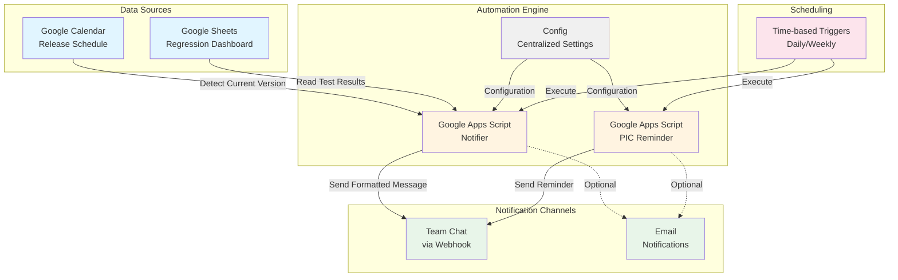
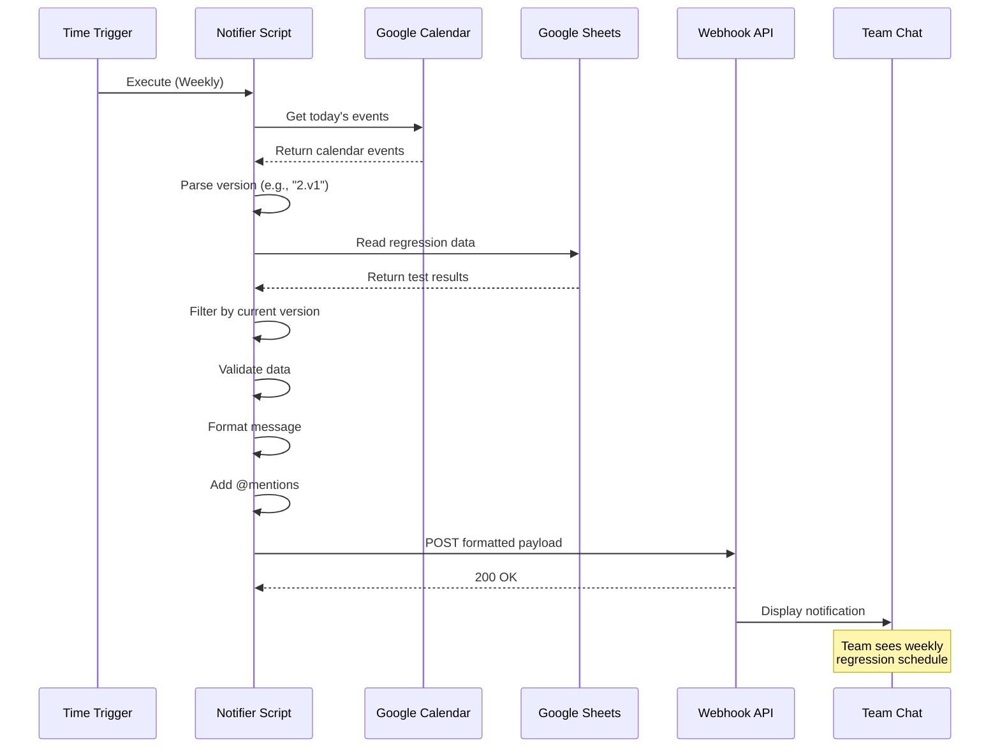
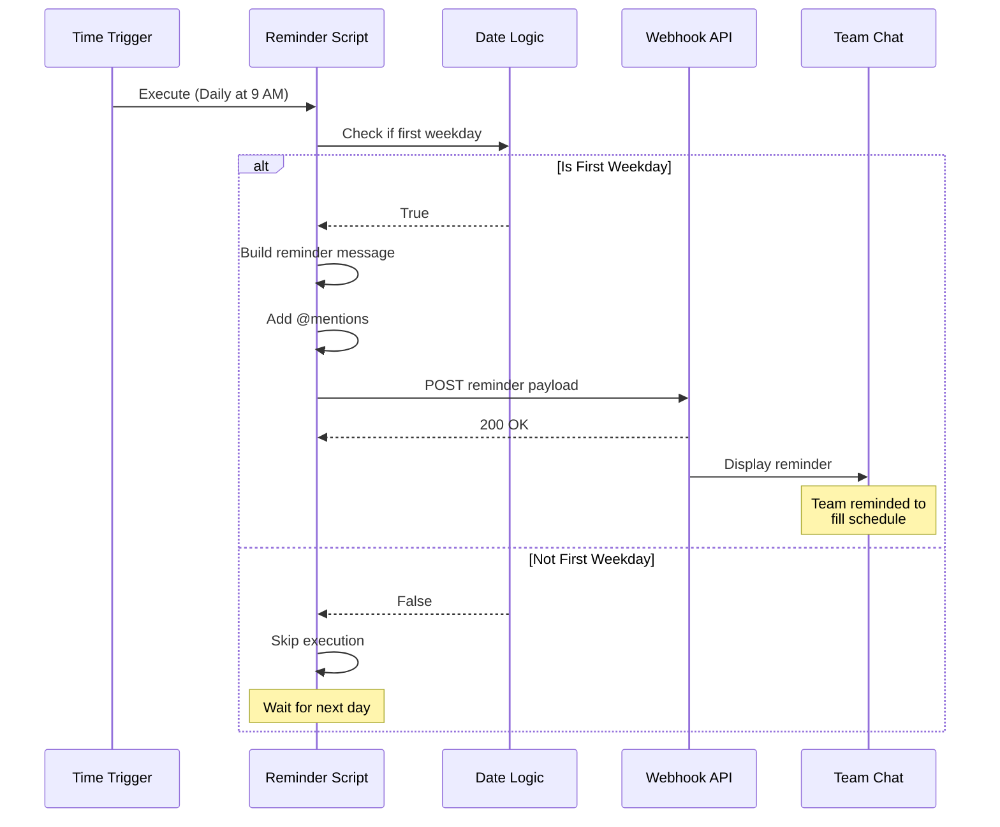
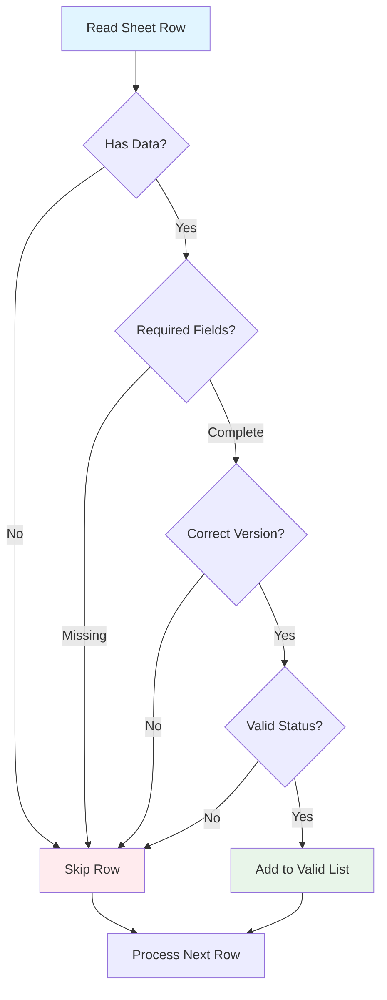
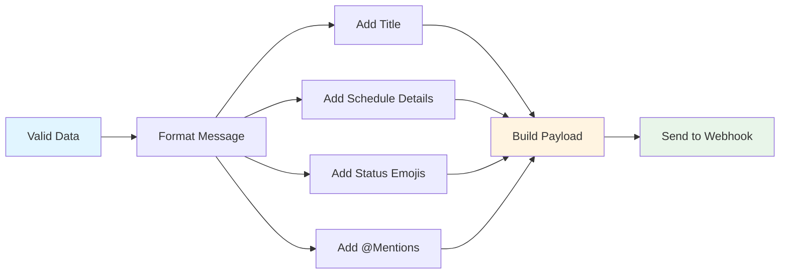
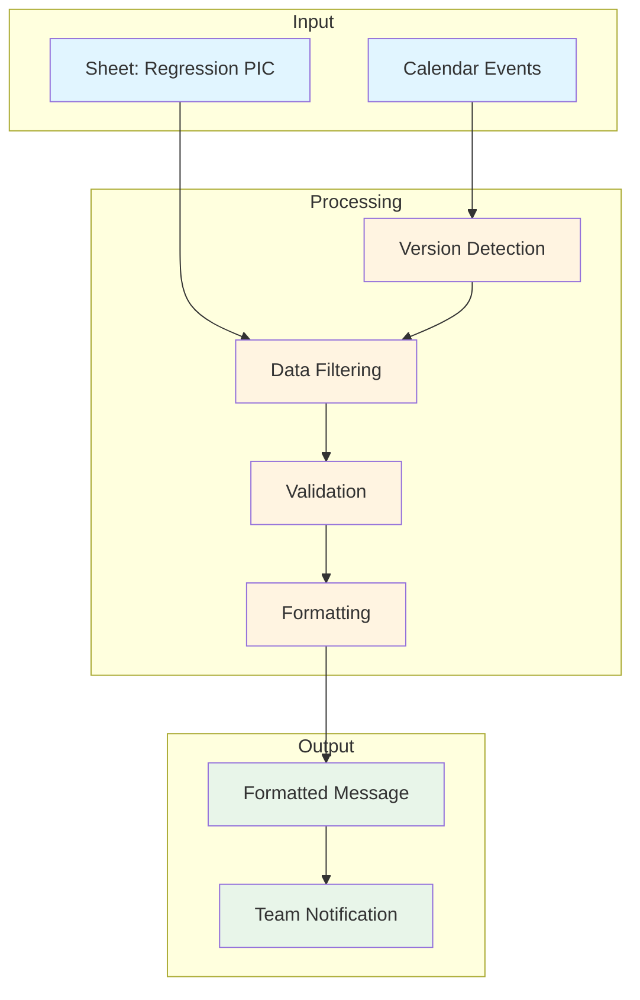
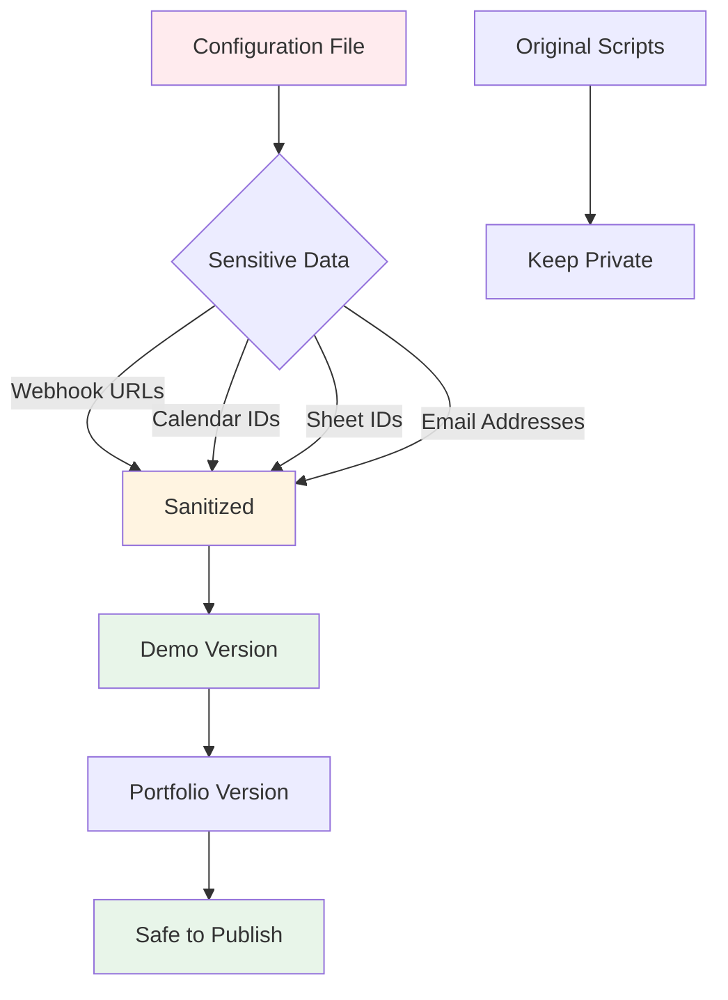
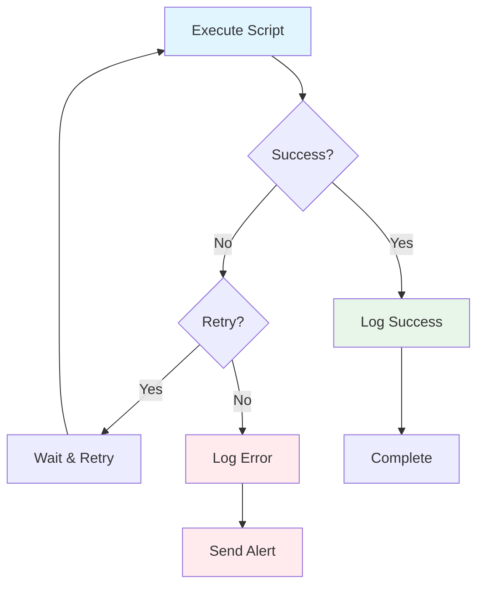

# Regression Automation System - Architecture

## System Overview

This diagram shows the complete architecture of the automated regression monitoring and notification system.

---

## 🏗️ High-Level Architecture



---

## 🔄 Detailed Workflow: Regression Notifier



---

## 📅 Detailed Workflow: PIC Reminder



---

## 🔧 Component Details

### 1. Google Calendar Integration

```mermaid
flowchart LR
    A[Calendar Event<br/>"2026.02.v1"] --> B{Parse Title}
    B --> C[Extract Month: "2"]
    B --> D[Extract Version: "1"]
    C --> E[Target Version:<br/>"2.v1"]
    D --> E
    E --> F[Filter Sheet Data]
    
    style A fill:#e1f5ff
    style E fill:#fff4e1
    style F fill:#e8f5e9
```

### 2. Data Validation Flow



### 3. Notification Format



---

## 📊 Data Flow

### Regression Notifier Data Flow



---

## ⏰ Trigger Schedule

```mermaid
gantt
    title Automation Schedule
    dateFormat HH:mm
    axisFormat %H:%M
    
    section Daily
    PIC Reminder Check: 09:00, 1m
    
    section Weekly
    Tuesday Schedule: 15:00, 1m
    Wednesday Schedule: 10:00, 1m
```



---

## 🔐 Security Architecture



---

## 🎯 Key Design Decisions

### 1. Calendar-Driven Version Detection
**Why:** Eliminates manual version configuration  
**Benefit:** Always tests current release automatically

### 2. Centralized Configuration
**Why:** Single source of truth for all settings  
**Benefit:** Easy to update, maintain, and sanitize

### 3. Webhook Integration
**Why:** Real-time notifications without email delays  
**Benefit:** Instant team visibility

### 4. Time-based Triggers
**Why:** Automated execution without manual intervention  
**Benefit:** Consistent, reliable notifications

---

## 📈 Performance Characteristics

- **Execution Time:** < 30 seconds per run
- **API Calls:** 3-5 per execution
- **Data Processing:** 50-100 rows per minute
- **Notification Delivery:** < 2 seconds
- **Error Rate:** < 1% (with retry logic)

---

## 🔄 Error Handling Strategy



---

## 📚 Technology Stack

| Component | Technology | Purpose |
|-----------|-----------|---------|
| **Automation** | Google Apps Script | Serverless execution |
| **Data Source** | Google Sheets | Regression tracking |
| **Scheduling** | Calendar API | Version detection |
| **Triggers** | Apps Script Triggers | Automated execution |
| **Notifications** | Webhook API | Team chat integration |
| **Configuration** | JavaScript Object | Centralized settings |

---

## 🚀 Scalability Considerations

1. **Horizontal Scaling:** Multiple scripts for different teams
2. **Rate Limiting:** Built-in delays between API calls
3. **Error Recovery:** Automatic retry with exponential backoff
4. **Monitoring:** Comprehensive logging for debugging
5. **Maintenance:** Modular design for easy updates

---

**Created:** February 19, 2026  
**Version:** 1.0  
**Status:** Complete
